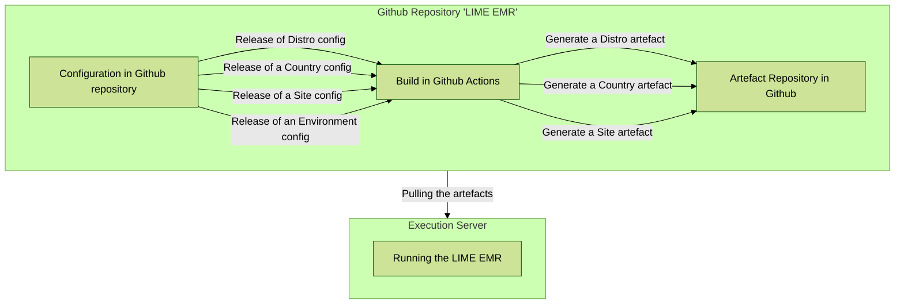

# MSF LIME EMR
Using Ozone Approach

## Configuration hierarchy and inheritance

### Assumptions
- There are **3 levels** of configurations: Distro < Country < Site
- The default **ineritance logic** is for lower levels to overwrite above ones
- **Configurations** includes backend and frontend binaries, frontend configs, initializer metadata, and assets like logos.
- It **primarly support OpenMRS**, but aims to be flexible and also support Senaite, Superset, OpenFN, FHIR, etc.

#### Hierarchy overview - example
```
── pom.xml - Aggredator / Orchestrator
      └── /distro/pom.xml - Organizational-wide Config
      └── /countries - Country-specific Config
            └── /iraq/pom.xl
      └── /sites - Site-specific Config
            └── /mosul/pom.xl
```

### Workflow diagram




## Example for configs for hierarchy demo of v1 - Week of April 8
### Ozone Level **OpenMRS RefApp**
- [x] Refapp stable version of [modules for frontend](https://github.com/openmrs/openmrs-distro-referenceapplication/blob/main/frontend/spa-assemble-config.json)
- [x] Refapp stable version of [modules for backend](https://github.com/openmrs/openmrs-distro-referenceapplication/blob/main/distro/pom.xml)
### MSF Distro **LIME EMR** repository
- [x] MSF [branding in frontend config](https://github.com/MSF-OCG/LIME-EMR-project-demo/blob/main/frontend/custom-config.json)
- [x] MSF [logo and assets](https://github.com/MSF-OCG/LIME-EMR-project-demo/tree/main/frontend/assets)
- [x] [Env specific logos](https://github.com/MSF-OCG/LIME-EMR-project-demo/blob/dev/frontend/qa/assets/logo.png) for users to easily identify their environment
### Country level: **Iraq**
- [x] [Roles config](https://github.com/MSF-OCG/LIME-EMR-project-demo/blob/main/distro/configuration/roles/roles_core-demo.csv) for Initializer
### Site level: **Mosul**
- [x] [Address hierarchy](https://github.com/MSF-OCG/LIME-EMR-project-demo/tree/main/distro/configuration/addresshierarchy) for Initializer
- [x] [Locations](https://github.com/MSF-OCG/LIME-EMR-project-demo/blob/main/distro/configuration/locations/locations.csv) for Initializer
- [x] [Person attributes](https://github.com/MSF-OCG/LIME-EMR-project-demo/blob/main/distro/configuration/personattributetypes/personattributetypes_core-demo.csv) for Initializer
- [x] [Initial consultation form](https://github.com/MSF-OCG/LIME-EMR-project-demo/blob/main/distro/configuration/ampathforms/initial_consultation-lime_demo.json)


## Quick Start

Build
```bash
./scripts/mvnw clean package
```

Running MSF Distro
```bash
source distro/target/go-to-scripts-dir.sh
./start-demo.sh
```

Running MSF Iraq
```bash
cd countries/iraq/target/ozone-msf-iraq-<version>/run/docker/scripts
./start-demo.sh
```

Running MSF Mosul
```bash
cd sites/mosul/target/ozone-msf-mosul-<version>/run/docker/scripts
./start-demo.sh
```

## Testing

1. Install prerequisites
   brew install jq
3. Clone EMR Tooling

4. Update install directory
   ```bash
   INSTALL_DIR="**.**/home/lime/$APP_NAME"
   ```
5. Disable logging in lime_emr.sh (success and error)
Function to log success messages
```bash
log_success() {
    echo "[$(date +'%Y-%m-%dT%H:%M:%S%z')] Success: $1" # >> "$SUCCESS_LOG"
}
```
Comment out Function to log error messages
```bash
log_error() {
    echo "[$(date +'%Y-%m-%dT%H:%M:%S%z')] Error: $1" # >> "$ERROR_LOG"
}
```
6. Comment out download_msf_artefact() function
```bash
   # curl -L -o "$download_name.zip" -H "$GITHUB_REQUEST_TYPE" -H "$GITHUB_AUTH_HEADER" -H "$GITHUB_API_VERSION" "$download_url" && log_success "Downloaded MSF Distro for the '$artifact_branch' branch." || log_error "Failed to download MSF Distro for the '$artifact_branch' branch."
```
7. Remove docker and package installation if needed

8. Run installation script
   chmod +x ./Procedures/lime_emr.sh
   sh ./Procedures/lime_emr.sh install mosul

## Roadmap

- [ ] In pom files, implement a **merge logic for frontend config JSONs** at the site level. It will merge frontend configs from the Distro, Country, and Site level together. The lower level will always overwrite the above level in case of conflicts. Example: [externalRefLinks for the esm-primary-navigation-app](https://github.com/MSF-OCG/LIME-EMR/blob/main/sites/mosul/configs/openmrs/frontend_config/msf-frontend-config.json)
- [ ] In pom files, replicate a similar logic for **initializer configuration files** - assumung that the lower level also always overwrite the above one.
- [ ] Simplify the **results of the build** currently generating muliple targets for all levels, rather than a single one for the execution level, being the Site level. Example: [ozone-msf-mosul-1.0.0-SNAPSHOT](https://github.com/MSF-OCG/LIME-EMR/packages/2120035)
- [ ] Ensure that the **Github Action build** is running the right level of configs upon release or manual trigger - not triggering all of them aspecially for performance savings pursposes:
      


## [Configuration](#configuration)

### [Inheritance hierarchy in configuration](#inheritance-hierarchy-in-configuration)

Configurations are pulled from parent level, modified as necessary in the current level and then applied. Modifiication of configuration at the cuurent level involves either the exclusion of non-needed configuration and/or inclusion of configuration that are specific at the current level. This process maintains inheritance from parent level to child level while facilitating easy customization and maintains consistency across levels.

### [Backend configuration](#backend-configuration)
We use the maven's `pom.xml` file at the root of each level to define what configuration should be applied.
We embrace maven's [maven resources plugin](https://maven.apache.org/plugins/maven-resources-plugin) to exclude/filter and include configs as different execution processes using the `copy-resources` goal.  This allows us to add or remove files while copying them form the parent level to the current level's build directory after the parent's download.

- #### [How to use the maven resources plugin](#how-to-use-the-maven-resources-plugin)
    ```xml
    <plugin>
        <groupId>org.apache.maven.plugins</groupId>
        <artifactId>maven-resources-plugin</artifactId>
        <executions>
            <!-- add executions to filter or add a file -->
        </executions>
    </plugin>
    ```

- #### [Excluding/Filtering files from parent level](#excluding-files-from-parent-level)
    ```xml
    <plugin>
        <artifactId>maven-resources-plugin</artifactId>
        ...
        <execution>
            <id>Exclude unneeded Ozone files</id>
            <phase>process-resources</phase>
            <goals>
                <goal>copy-resources</goal>
            </goals>
            <configuration>
                <outputDirectory>
                    <!-- destination of the file to copy-->
                    ${project.build.directory}/${project.artifactId}-${project.version}
                </outputDirectory>
                <overwrite>true</overwrite>
                <resources>
                <resource>
                    <directory>${project.build.directory}/ozone</directory> <!-- source of the file to copy -->
                    <excludes>
                    <!-- exclude unneeded files here like: <exclude>distro/configs/**/ampathforms/*.*</exclude> -->
                    </excludes>
                </resource>
                </resources>
            </configuration>
        </execution>
        ...
    </plugin>
    ```

- #### [Including files to current level](#including-files-to-current-level)
    ```xml
    <plugin>
        <artifactId>maven-resources-plugin</artifactId>
        ...
        <execution>
            <id>Copy MSF Disto docker compose .txt file</id>
            <phase>prepare-package</phase>
            <goals>
                <goal>copy-resources</goal>
            </goals>
            <configuration>
                <outputDirectory>
                    <!-- destination of the file to copy-->
                    ${project.build.directory}/${project.artifactId}-${project.version}/run/docker/scripts
                </outputDirectory>
                <overwrite>true</overwrite>
                <resources>
                <resource>
                    <directory>${project.basedir}/../scripts</directory> <!-- source of the file to copy-->
                    <includes>
                    <!-- add more needed files here like: <include> docker-compose-files.txt</include> -->
                    </includes>
                </resource>
                </resources>
            </configuration>
        </execution>
        ...
    </plugin>
    ```

    #### [Initializer Data](#initializer-data)
    At the current level, metadata is loaded through the Initializer module. A CSV file is added to the `configs/openmrs/initializer_config` folder at the current level and if the parent level defines the same `.csv` file, the corresponding file is excluded like showed below. Read more about the initializer configuration [here](https://github.com/mekomsolutions/openmrs-module-initializer/blob/master/README.md#introduction).

    <strong>Example</strong>

  

### [Frontend Configuration](#frontend-configuration)
MSF configuration are loaded using the [msf-frontend-config.json](https://github.com/MSF-OCG/LIME-EMR/blob/main/distro/configs/openmrs/frontend_config/msf-frontend-config.json)
We use the [Apache Maven AntRun Plugin](https://maven.apache.org/plugins/maven-antrun-plugin/) to execute a task that replaces the ozone configuration file in the `.env` file that docker compose uses while building the frontend. The `.env` file is located in the `target/run/docker/.env` at the current level.

Below is how its done
```xml
<plugin>
    <groupId>org.apache.maven.plugins</groupId>
    <artifactId>maven-antrun-plugin</artifactId>
    <version>3.1.0</version>
    <executions>
        <execution>
        <id>Add MSF-OCG LIME Frontend Configuration to ozone</id>
        <phase>process-resources</phase>
        <goals>
            <goal>run</goal>
        </goals>
        <configuration>
            <target>
            <echo message="Adding msf frontend config"/>
            <replaceregexp
                file="${project.build.directory}/${project.artifactId}-${project.version}/run/docker/.env"
                match="ozone-frontend-config.json"
                replace="msf-frontend-config.json"
            />
            </target>
        </configuration>
        </execution>
    </executions>
</plugin>
```
This task replaces all the occurrences of the sting `ozone-frontend-config.json` with `msf-frontend-config.json`
After building the project using maven, the  `SPA_CONFIG_URLS` variable (it specifies the location of the frontend config file inside docker) in the `.env` file will have a value of `/openmrs/spa/ozone/msf-frontend-config.json`

> Note: Docker compose will only load the file passed to the `SPA_CONFIG_URLS` in the `.env` file.  This means that any other file present in the `target` but not added to the `SPA_CONFIG_URLS` will be ignored.

### [Inheritance in Frontend Configuration](#inheritance-in-frontend-configuration)
The OpenMRS frontend tooling supports loading a frontend configuration on top of the currently loaded configuration.  This means that we can use one file to load general frontend configuration like at `Organization level` branding and logos, and at site level, an `obs-table` on top of the patient chart.   Both these configuration will be loaded successfully.

We can also use the child frontend configuration file to override the inherited frontend configuration. This implies that each level should have its own frontend configuration file in case it needs to load new frontend configuration.

<strong>Examples</strong>
- At organization level
    in pom.xml file
    ```xml
    <replaceregexp
        file="${project.build.directory}/${project.artifactId}-${project.version}/run/docker/.env"
        match="ozone-frontend-config.json"
        replace="msf-frontend-config.json"
    />
    ```
    result to the `.env` file after build
    ```properties
    SPA_CONFIG_URLS=/openmrs/spa/ozone/msf-frontend-config.json
    ```

- Site frontend configuration inheriting from Organization level
    in pom.xml file
    ```xml
    <replaceregexp
        file="${project.build.directory}/${project.artifactId}-${project.version}/run/docker/.env"
        match="(SPA_CONFIG_URLS=.+)"
        replace="\1,/openmrs/spa/ozone/msf-mosul-frontend-config.json"
    />
    ```
    result to the `.env` file after build
    ```properties
    SPA_CONFIG_URLS=/openmrs/spa/ozone/msf-frontend-config.json, /openmrs/spa/ozone/msf-mosul-frontend-config-json
    ```

## [FAQ](#faq)

## Release Notes

### 1.0.0-SNAPSHOT (in progress)
